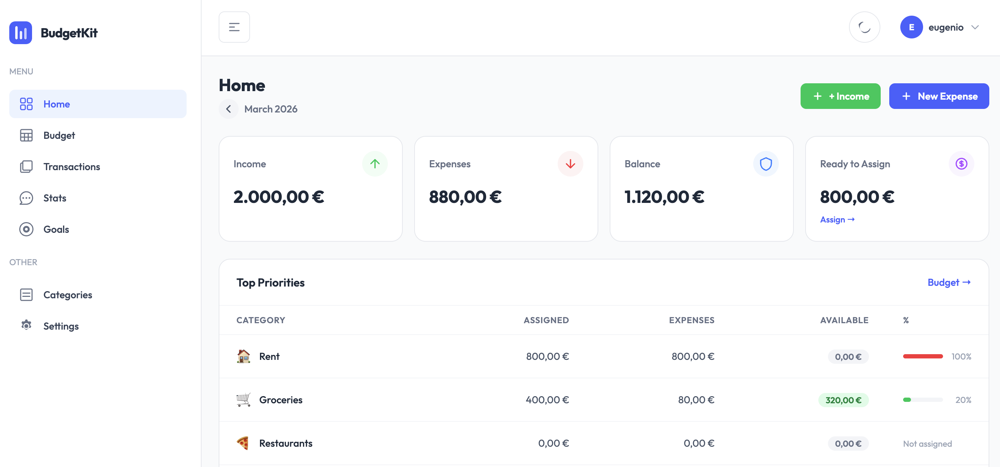
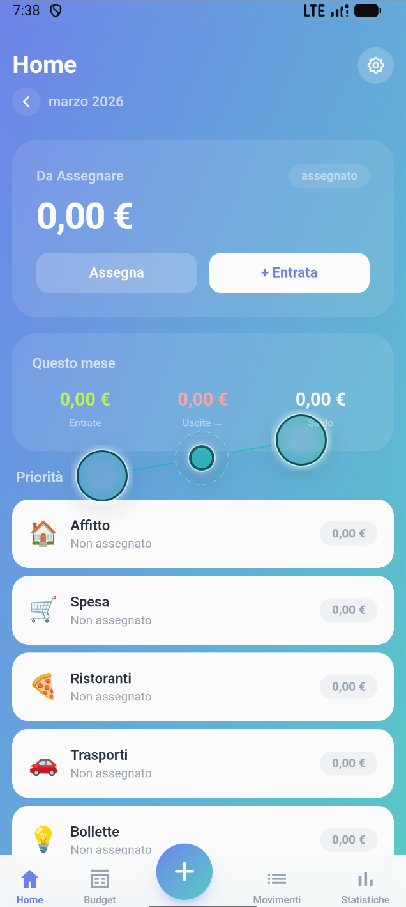

<p align="center">
  
</p>

<h1 align="center">BudgetKit</h1>

<p align="center">
  <strong>Take control of your finances.</strong><br/>
  Open source personal finance manager — built with Laravel & Tailwind CSS.
</p>

<p align="center">
  
  
  
  
</p>

<p align="center">
  <a href="https://budgetkit-topaz.vercel.app/">budgetkit-topaz.vercel.app</a>
</p>

> **⚠️ Beta project** — core features are stable, but some sections are still under active development.

---

## Demo

[](https://www.youtube.com/watch?v=FNFq3y3eKG8)

---

## What is BudgetKit

BudgetKit is a web application for personal finance management. It lets you track income and expenses, set a monthly budget per category, monitor savings goals and visualize spending statistics — all with a clean interface including dark mode.

The layout automatically adapts to the device: **desktop interface** with sidebar and tables, **mobile interface** with gradient UI and bottom tab navigation — no app to install.

---

## Screenshots

<table>
  <tr>
    <td align="center"><b>Desktop</b></td>
    <td align="center"><b>Mobile</b></td>
  </tr>
  <tr>
    <td></td>
    <td></td>
  </tr>
</table>

---

## Features

- **Dashboard** — instant overview: available balance, total assigned, active goals
- **Transactions** — record income and expenses, filter by type and month
- **Budget** — assign a monthly budget per category, copy budget from previous month
- **Goals** — create savings goals with target amount and visual progress
- **Statistics** — donut chart by category + monthly income/expenses trend (6 months)
- **Categories** — manage custom categories with emoji and color
- **Settings** — language (IT/EN) and currency (EUR, USD, GBP, CHF)
- **Export/Import CSV** — export and import all transactions
- **Auth** — registration and login, profile with name/email/password editing
- **Dark mode** — native support
- **Multi-language** — Italian and English
- **Automatic responsive** — desktop layout with sidebar on PC, optimized mobile layout on smartphone (User-Agent detection)
---

## Tech Stack

| Layer | Technology |
|---|---|
| Backend | Laravel 12 (PHP 8.2+) |
| Frontend | Blade, Tailwind CSS v4, Alpine.js |
| Charts | ApexCharts |
| Database | SQLite (default) / MySQL / PostgreSQL |
| Base template | TailAdmin Laravel |

---

## Installation

### Requirements
- PHP 8.2+
- Composer
- Node.js 18+

### Setup

```bash
# 1. Clone the repository
git clone https://github.com/your-username/budgetkit.git
cd budgetkit

# 2. Install PHP dependencies
composer install

# 3. Install JS dependencies
npm install

# 4. Configure the environment
cp .env.example .env
php artisan key:generate

# 5. Configure the database in .env, then run migrations
php artisan migrate

# 6. Build assets
npm run build

# 7. Start the server
php artisan serve
```
---

## License

Distributed under the **GNU General Public License v3.0**. See [`LICENSE`](LICENSE) for details.

In short: you are free to use, modify and distribute this software, but derivative works must be released under the same GPL-3.0 license.